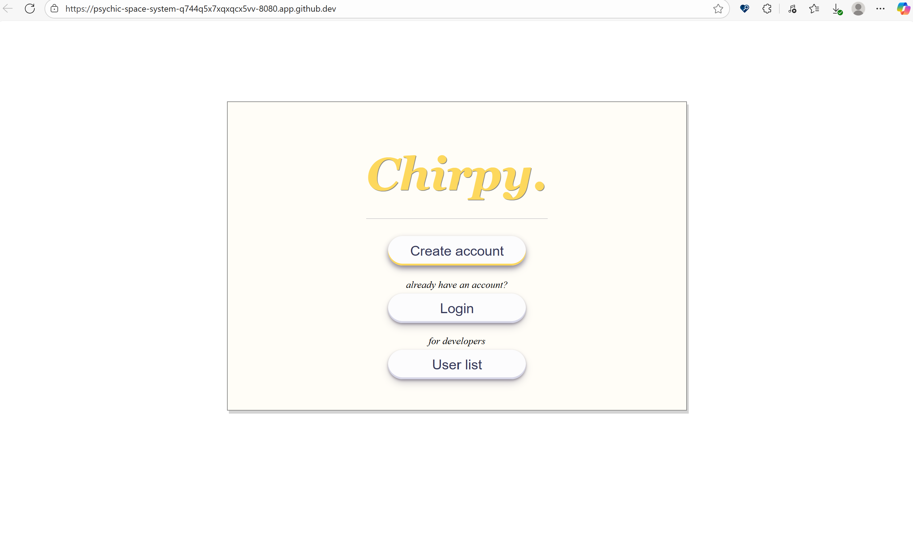
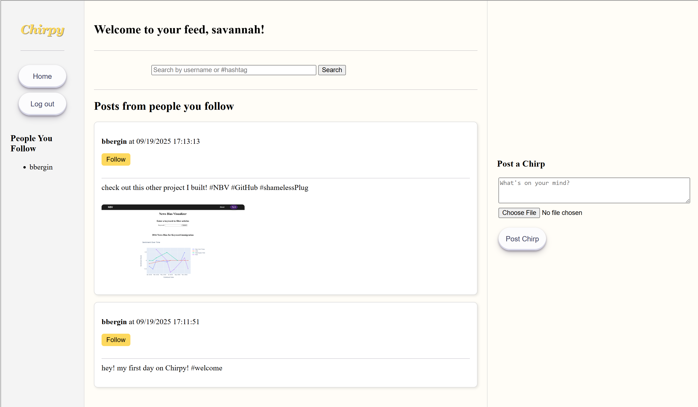

# Chirpy
Chirpy is a Twitter-like social media platform developed as a group project for Advanced Programming (Spring 2025, Georgetown University). Users (chirpers) create short posts (chirps) containing text, hashtags, and/or images, follow other users, and curate their timeline by searching by username or hashtag.

## Table of Contents
- [My Contributions](#my-contributions-to-chirpy)
- [Accomplishments](#accomplishments)
- [Project Structure](#project-structure)
- [Usage](#usage)
    - [Example](#screenshots)
 

## My Contributions to Chirpy
* Served as the group's front-end engineer, designing and implementaling all HTML/CSS for the project
* Implemented backend functionality for searching and displaying posts by username and hashtag
* Developed an image-posting feature that extended beyond project requirements
* Collaborated with a team of 4 using GitHub branches, merges, and pull requests

## Accomplishments
* Designed and implemented core functionality (front-end and back-end)
* Produced a design document, source code documentation, and test cases
* Adhered to a team style guide
* Gained experience in web programming, client-server interaction, and git-based collaboration

## Project Structure

* [data access objecs (DAO)](/src/main/java/edu/georgetown/dao/): a package containing classes which represent the various data objects used by Chirpy, including representations of a Chirper (user); a Chirp (post); and others.

* [business logic layer (BLL)](/src/main/java/edu/georgetown/bll/): a package containing classes which implement the behaviors and logic of Chirpy.

* [display logic (DL)](/src/main/java/edu/georgetown/dl/): a package containing classes that determine the appearance of our site to the user.

# Usage

You can run Chirpy from inside your Codespaces environment and access the web service via your web browser.

To run Chirpy:
1. Open [Chirpy.java](/src/main/java/edu/georgetown/Chirpy.java)
2. Run the file (F5, run arrow, or "Start Debugging")
3. In the PORTS tab, forward port 8080
4. Use the formarded URL to access Chirpy in your browser
   
**Notes**
* This site runs locally only
* Posts and accounts exist only during the session and reset when Codespaces is stopped

## Screenshots

