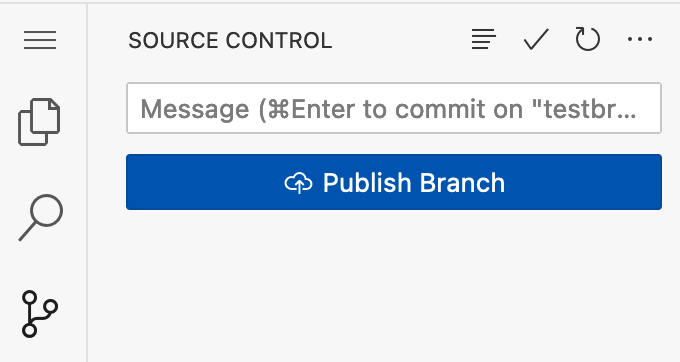

# My Contributions to Chirpy
This social media tool was created as a group project in Spring 2025 Georgetown University Advanced Programming. I served primarily as the group's front-end engineer, creating all of the HTML and CSS for this project. On the backend, I created the functions for searching/displaying posts by username and hashtag. 

On this project, I went a step above the requirements by making the CSS elaborate (as no html/css was explicity required). We also chose to include the option to post images, a feature I worked on.

The following information was the original README given to the class.

# Programming Assignment: Chirpy
## COSC 2020 - Advanced Programming

- [Goals](#goals)
- [Description](#description)
- Specification and requirements
  - [Specification](#specification)
  - [Requirements](#requirements)

## Goals

To complete this assignment, you will
- Work in a group of your peers to create a signficiant and complex software system
- Write a design document
- Write source code documentation
- Adhere to a team style guide
- Manage source code in git (including using branches and merges)
- Do web programming (interacting with a provided web server)
- Write test cases

## Description

During the next two programming assignments (creatively named, "Chirpy 1.0" and "Chirpy 2.0") you will build a Twitter-like short-message web service. We'll call this service "Chirpy" in this document, but you are free to chose a much better name if you like.

*Yes, we know that Twitter is now called $\mathcal{X}$. No, we won't be rebranding Chirpy as $\mathcal{C}$ as part of Chirpy 2.0.*

This (very long) README will describe the features and functionality of Chirpy. You will implement parts of this specification in Chirpy 1.0 and the remainder in Chirpy 2.0; see the [Requirements](#requirements) section for the details.

### What is Chirpy?

Chirpy is a Twitter-like service in which users (*chirpers*) can create short messages (*chirps*). Chirps can contain #hashtags, which are strings (i.e., without spaces) beginning with a # symbol.

Users must first create an account and then log into the site, at which point they will view the main screen for Chirpy: a *timeline* which contains chirps created by the users's *contacts* (other chirpers which this user follows).

The main screen will also feature a search option where a user can either;
1. Type the username of another chirpy and view a timeline of that chirper's chirps.
2. Type a #hashtag and view a timeline of chirps (by any user) which contain that hashtag.

## Specification

The specification for this project is purposely left somewhat open-ended to allow your group room for creativity and we've tried to keep the requirements minimal. 

You will work together as a team to design, implement, and test Chirpy. You should give your project a name; you can use "Chirpy" if you like or you can choose a better name

### Minimum features

Your implementation must, at a minimum, provide the functionality and experience from the [Description](#description):
* Anyone can register as a chirper by providing a (unique) username and a password
* Any registered user can log in by providing their username and password
* Upon logging in, a user should see a timeline of chirps created by their contacts
  * This may be empty if the user does not follow anyone and/or nobody has chirped yet
* A user may enter a search query to see a timeline:
  * If the user searches for a username, they should see chirps by that user
  * If the user searches for a #hashtag, they should see chirps containg that hashtag

Users should be able to navigate through the web site by clicking links on pages. This may include links to the page for registering a user; logging in; and viewing their home timeline. Especially in Chirpy 1.0, this may also include links to "debugging" pages that, e.g., display the usernames of all registered users.

### Extra feature

Your group will also choose and implement one "special feature" not listed above. Examples of a special feature include:
* Support for secure authentication/login cookies (beyond what is demonstrated in the starter code)
* A persistent-state backend which stores user/chirp information and restores it after a server reset
* Support for attaching an image to a Chirp
* "Moderator" accounts which have permission to perform special actions (like removing individual chirps and/or suspending user accounts)
* Something clever that I haven't thought of (talk to me for approval -- I want to make sure it's reasonable in scope!)

### Provided code

The provided code in your repo includes a number of files, but is (roughly) divided into three main packages:

* [data access objecs (DAO)](/src/main/java/edu/georgetown/dao/): a package containing classes which represent the various data objects used by Chirpy. These will likely include representations of a Chirper (user); a Chirp (post); and others.

* [business logic layer (BLL)](/src/main/java/edu/georgetown/bll/): a package containing classes which implement the behaviors and logic of Chirpy. A common naming convention for these is "service" and will likely include a UserRegistrationService, UserAuthenticationService, ChirpCreationService, SearchService, or similar behaviors. Expect these objects to make use of the DAO classes to store information as Chirpy runs.

* [display logic (DL)](/src/main/java/edu/georgetown/dl/): a package containing classes that determine the appearance of your site to the user. This will mainly involve producing the HTML documents which are served in response to HTTP requests by gathering the data which should appear on such pages. Expect these objects to make use of the BLL classes by requesting specific behaviors or data which the BLL will perform/retrieve.

You will find [skeleton code](#the-skeleton-code) in each of these classes demonstrating simple proof-of-concept behaviors and appearances. I highly recommend you use this code as a jumping-off point, but you may deviate from it and/or change its behaviors as you need.

## Requirements

This section will break down the specified features into two groups: those whose implementation is required for Chirpy 1.0 and those whose implementation can be left for Chirpy 2.0. Note that the design document is a Chirpy 1.0 deliverable but will include a design for the Chirpy 2.0 features -- this is so you can plan ahead!

### Chirpy 1.0, Part I: Writing a design document

Your first task for Chirpy 1.0 is to construct a high-level design document for your service. The design document should be written in [Markdown](https://docs.github.com/en/get-started/writing-on-github/getting-started-with-writing-and-formatting-on-github/basic-writing-and-formatting-syntax).  (Click [here](https://docs.github.com/en/get-started/writing-on-github/getting-started-with-writing-and-formatting-on-github/basic-writing-and-formatting-syntax) for a good primer on Markdown; also, the file you're reading now is written in Markdown, so see that for a good example.)

Your high-level design document should:

* List and briefly describe the functionalities supported by Chirpy.  This should include, for example:
  * adding a new user and setting its password
  * submitting a chirp
  * rendering a timeline
  * searching for chirps via hashtag
  * searching for chirps via chirper (i.e., searching for `MicahSherr1`'s chirps)
* Describe the classes that make up the DAO.  Class descriptions should include all of the "public" functions that will be used by the BLL.  For example, a User class might include functions such as:
  * `void setUsername( String username )`
  * `String getPassword()`
* Class descriptions should include the method names (i.e., the API) and brief descriptions of what each does and what the parameters and return values are.
* Your design document should describe how the various class objects will be stored.  Initially, you may store everything in memory (yikes!) -- e.g., registered users could persist in a [Vector](https://docs.oracle.com/javase/8/docs/api/java/util/Vector.html) or [HashMap](https://docs.oracle.com/javase/8/docs/api/java/util/HashMap.html).  Be sure to also describe how a chirper's contacts are stored/maintained.
* Describe what your cookies look like (see below).
* Similarly, describe the classes that make up the BLL.  Here, classes will refer to your service's main *functionalities*.  For example, you might have a classes called `SearchFunctionality` and `ChirpHandler`.

The design document should exist as a single Markdown file called `DESIGN.md`, and be stored in the top level of your repository (i.e., next to this `README.md` file).

*Note that you won't be implementing all of these features in Chirpy 1.0 (see below); some parts of this design will be implemented in Chirpy 2.0* 

### Chirpy 1.0, Part II: The beginnings of Chirpy

The second task for Chirpy 1.0 is to implement functionality on your service such that you can
* Register a new user
* Login using an existing user's credentials
* List all existing usernames on a single page

#### Registering a new user

Your sevice should allow a user to navigate to `https://yourdomain/register/` (or similar) and be presented with a registration form. (See below for information about hosting the site and the skeleton code that is written for you. Don't panic if you haven't done web programming before -- much of this is already written for you and there are examples).

The registration form should, at a minimum, ask the user to provide a username, password, and ***password confirmation*** (i.e., they should enter their password twice). When your service receives this information, it should verify that
* The username is unique (i.e., the user does not already exist)
* The password and password confirmation match
Notify the user if either of these errors exist so they know what has happened.

Assuming the passwords match and the username is new, your service should "create" a new user. The details of "create" depend on your design, but should mean there's some record of the user kept in your program's memory. (This likely involves your BLL creating some object from your DAO).

Do not impose any artificial limits (i.e., hardcode) the number of users which may register. When storing user information in memory, use a dynamically-sized data structure such as a [Vector](https://docs.oracle.com/javase/8/docs/api/java/util/Vector.html) or [HashMap](https://docs.oracle.com/javase/8/docs/api/java/util/HashMap.html).

#### Logging in

Your service should allow a user to navigate to `https://yourdomain/login/` (or similar) and be presented with a login form requesting a username and password. If (and only if) the user enters a username and password of a registered user, then your service should indicate that login was successful; otherwise is should show some sort of error message.

Importantly, if the login was successful, your service should also send a [cookie](https://en.wikipedia.org/wiki/HTTP_cookie) to the user's browser. A cookie is a small piece of data that a web service stores on a user's browser. Specifically, this cookie will be an *authentication cookie* meaning it contains the user's identity (i.e., their username).

Cookies are kept by a browser so that, whenever the user returns to your site, the browser can automatically send the cookies (belonging to your site) alongside any HTTP request. This means that your service can check for a cookie and "remember" that the user is logged in. This is how a login persists when you navigate to other pages such as the timeline/search/chirp authoring pages (that will appear in Chirpy 2.0).

Sample code for creating and retrieving a cookie is part of the skeleton code below.

#### Listing all users

Lastly, to make testing easier for me (and you), you should support a page like `https://yourdomain/listusers/` (or similar) that (as the name suggests) prints a list of all registered users that your server remembers.

### Using branches

Each group member should have a separate branch on which they will work.  We are **requiring** that each student work in their own branch and not directly on the `main` branch.  However, once ready, students should switch to `main` and merge in the changes from their individual branches.   

We will deduct points if students do not work in their own branches.  Part of the purpose of this homework is to learn good source code management techniques, including how to effectively use `git`.

As a reminder, students can create a branch by clicking on the bottom-left side in Codespaces where it says "main" (or whatever branch the student is currently using):

Once clicked, select "Create a branch".

Note that it's very important that students publish their own branches to github.  That is, after committing on your new branch, make sure that select "Publish Branch" under the left-hand source control menu.

### Running Chirpy

You can run Chirpy from inside your Codespaces environment and access the web service via your web browser.

To run Chirpy, either press F5 when you have `Chirpy.java` open, or select "Start Debugging" from the left-hand side "hamburger" menu.  

To actually access Chirpy using your web browser, you'll need to set up "port forwarding".  (This is necessary because Chirpy is running inside of a VM located in GitHub's servers; you need to allow outside access to it.)  To do that, click on the PORTS tab at the bottom of your Codespaces environment:

Then, click on "Forward a Port".

Enter `8080` as the port number.  Hit Enter.

You'll see something appear under "Forwarded Address".  That's the URL that you'll need to access Chirpy.  It's dependent on your particular Codespaces environment, and will stop working when Codespaces is shutdown.  It's also hard to type.  If you hover over it with your mouse, a globe icon will pop up.  If you click that, it'll open in your browser.  (Of course, Chirpy should be running first.  If you didn't run it, there's nothing that will "respond" to your web browser.)

  
*Note*: The Port Forwarding portion of Codespaces allows you to set it as private (the default) or public.  If it's private, only you (the person logged into GitHub) can access it.  If you want to open it up to the world, set it to public.

### Submitting Chirpy

As with all assignments in this class, you'll be submitting via GitHub.  To share with the instructors and the TAs, you should push your code to the `main` branch of your repository.

### Group dynamics

You and your groupmates should work as a team.  The teaching staff isn't well-positioned to interpret who did what, and you'll all be receiving the same grade for this assignment.

If there are issues with teammates, you should reach out to a member of the teaching staff as soon as possible through email.

It's up to your group to figure out how to split the work.  A reasonable approach might be:

* Person A: Project manager.  Reviews ALL code and decides what gets added to the `main` branch
* Person B: Frontend engineer.  Responsible for creating the templates for the various Chirpy pages
* Person C: Backend developer.  Implements the business logic components for adding users.
* Person D: Backend developer.  Implements the "extra" requirement for this project.

All group members should work collaboratively on the design document, as it will affect all aspects of this project.

## Outside resources

Following course policy, you are allowed to use ChatGPT and other large language models for this project.  However, you must identify all cases in which these are used.

You may also use outside libraries, with the following conditions.  You must request the use of the library on Ed Discussion and receive the approval of a TA or the instructor.  The library must be free, open-source software.  And, you should update your design document to properly cite the library.

